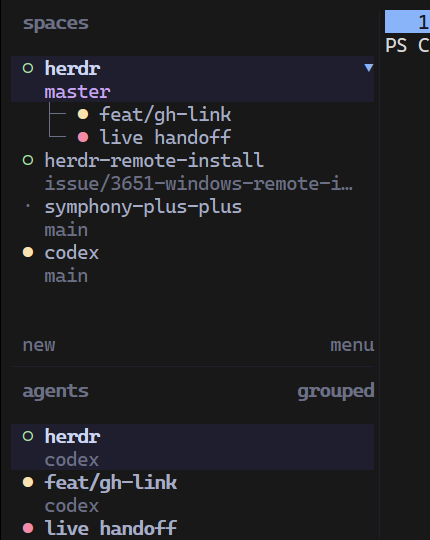
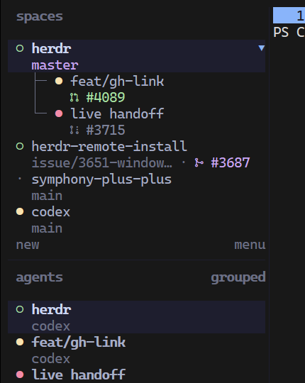

# Herdr Plugins

Small, independently installable plugins for [Herdr](https://github.com/herdrdev/herdr).

| Plugin | What it does | Install |
| --- | --- | --- |
| [GitHub Tools](github-tools/) | Shows pull-request status in the Spaces sidebar and opens the current repository or pull request. | `herdr plugin install JJLiebig/herdr-plugins/github-tools` |
| [Simple Dispatch](simple-dispatch/) | Turns issues, pull requests, features, and fixes into isolated agent workflows. | `herdr plugin install JJLiebig/herdr-plugins/simple-dispatch` |
| [Herdr Stream Deck+](stream-deck/) | Adds physical triage and control for Herdr on Stream Deck+. | `herdr plugin install JJLiebig/herdr-plugins/stream-deck` |

Install only the plugins you want. Each plugin owns its manifest, dependencies,
configuration, state, and tests.

## GitHub Tools visual direction

These screenshots are from the earlier [Herdr PR #4089](https://github.com/herdrdev/herdr/pull/4089) design exploration. GitHub Tools currently shows pull-request status through the `$github_pr` sidebar token; the symbol and Nerd Font icon modes pictured below are **not** part of the plugin.

| Before | Symbols | Nerd Font |
| --- | --- | --- |
|  |  |  |
