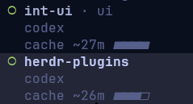

# Cache Timer

A best-effort cache countdown in Herdr's Agents sidebar:



Requires Herdr 0.9.0+ and Node.js 18+. No dependencies or provider requests.

## Install

```sh
herdr plugin install JJLiebig/herdr-plugins/cache-timer
herdr plugin action invoke jjliebig.cache-timer.watch
```

The action starts the timer in an existing Herdr session; future sessions start
it automatically. Repeating the action is harmless.

Add `["$cache"]` to your existing `[ui.sidebar.agents]` rows in Herdr's config
(`%APPDATA%\herdr\config.toml` on Windows, `~/.config/herdr/config.toml` elsewhere).
For example, with the default rows:

```toml
[ui.sidebar.agents]
rows = [
  ["state_icon", "machine", "workspace", "tab"],
  ["agent"],
  ["$cache"],
]
```

Run `herdr server reload-config`. Use `$cache_short` instead on narrow sidebars
to show only `cache ~24m`. The current plugin API cannot put this row in a pane's
bottom border; that requires a separate Herdr UI extension.

## Choose the estimate

Defaults are **Codex: 60 minutes**, **Claude: 1 hour**. These are estimates,
not measured retention. Unknown agents show `cache ?`.

From an agent pane, use the plugin actions to select 5 minutes, 30 minutes,
1 hour, or the default. This only changes the displayed estimate; it does not
change the provider's cache policy. An override belongs to that terminal and
reported session, so moving a pane preserves it but changing sessions clears
its effect. Changing the estimate does not restart the countdown.

To change defaults, create `config.json` in the directory printed by
`herdr plugin config-dir jjliebig.cache-timer`:

```json
{
  "agents": {
    "codex": "1h",
    "claude": "1h"
  }
}
```

Keys match Herdr's `agent` labels, ignoring case. Values are positive durations
in minutes or hours; `null` means unknown. Changes apply on the next 20-second check.
There is no automatic model, provider, subscription, or environment detection.
After switching models or providers in the same session, choose the matching
estimate yourself. A custom provider using the Codex label inherits its default.

Why these defaults (checked September 20, 2026):

- Codex: a 60-minute estimate based on a local cache-retention experiment,
  not a provider guarantee or a measured lifetime for every session.
- [Claude Code](https://code.claude.com/docs/en/prompt-caching#cache-lifetime):
  included subscription usage normally gives the main conversation one hour;
  API/cloud/usage-credit billing defaults to five minutes. Subagents generally
  use five minutes. `promptCacheTtl` and `subagentPromptCacheTtl` can request
  different lifetimes. The plugin defaults to the main subscription conversation;
  select five minutes for billed usage or subagents when appropriate.

## What the timer knows

The watcher checks Herdr's lifecycle sequence every 20 seconds. A new settled
state starts the estimate, including short turns completed between checks.
Focusing a completed pane or refreshing its title does not restart it.
The cache display is hidden while the agent works; time still passes
while blocked. The bar measures the assumed time window, not cached tokens.

Initially, and after the watcher restarts or Herdr reports a different session,
the display is `cache ?` until a new completion is observed. No conversation
transcripts are read or stored. Without a reported session ID, an in-place
session change cannot always be distinguished. Interrupted work can also settle
to idle: this estimates lifecycle completion, not successful provider caching.

The provider's clock follows requests, not the final message. Long responses,
compaction, prefix changes, routing, or mixed cache lifetimes can make the
estimate optimistic. `0m` (or `window elapsed` in the compact display) does not
prove eviction. No keepalive
requests are sent. Display metadata expires within 90 seconds if the watcher
stops, the plugin is disabled, or the pane stops being an agent.

All file and socket I/O is asynchronous. The watcher talks directly to Herdr's
local socket/Windows named pipe: no CLI subprocesses, transcript reads, or provider
requests. Each cycle reads plugin status and the agent list once. Pane metadata
is written only when the display changes or its 60-second renewal is due. Cycles
run sequentially, with a 20-second wait between them; slow requests never overlap
the next cycle.

## Validate

```sh
cd cache-timer
npm run check
```
